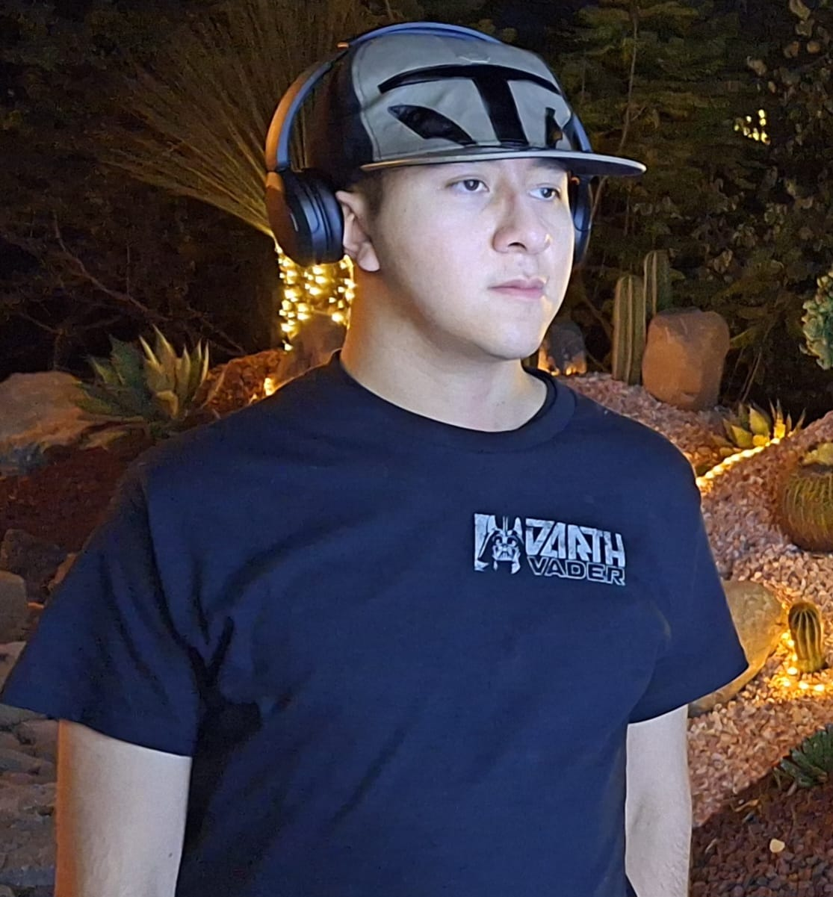

# **_Acerca de mí_**

### **Índice**
- [Presentación](#Presentación)
- [Lista](#lista)
- [Pasatiempos](#pasatiempos)
- [foto de referencia](#foto-de-referencia)
- [Datos de contacto](#datos-de-contacto)

---

### **Presentación**

Mi nombre es Abbi Jared Loza Luna o simplemente *Jared Loza*, tengo 20 años, nací el 22 de diciembre del 2003 en la Ciudad de México, mis gustos se basan en los videojuegos, la música, la tecnología y en los libros.

Desde que tuve la edad de 6 años descubrí los videojuegos, específicamente en la consola Xbox 360, juegos como _**Lego** Indiana Jones_, _**Lego** Star Wars_, _Gears of War 2_  y _**Call of Duty** Modern Warfare 2_.

A medida de que pasaba el tiempo, fui conociendo una variedad de géneros; como por ejemplo: Género de _Shooters_, _aventuras_, _Terror_, _Mundo Abierto_, _Simuladores_, Peleas, RPG, _Survivals_, _Musicales/Ritmo_, entre otros Géneros.

Elegí la ingeniería en programación de Software de videjuegos por ser muy fan de los juegos de **Xbox**, pero en especial del _**Call of Duty Zombies**_ me llamó la atención el querer ser un diseñador de mapas, ya que es el modo que más me solía gustar, también para tener cierto estatus como programador para poder tener la oportunidad de trabajar en los estudios de juegos AAA de **Xbox**.


---


### **Lista**
Los géneros con mis juegos o sagas preferidos:

| _Shooters_    | _RPG_       | _terror_  | _Survival_  | _Táctico_  | _Simulador_  |   _Peleas_             |
| ------------  | ----------  | --------- | ----------- | ---------- | -----------  | --------------------    |
| [Call of Duty](https://www.callofduty.com/es)  | [Dead Island](https://www.xbox.com/es-MX/games/store/dead-island-definitive-edition/bs7f51g3dp8r) | [Outlast](https://www.xbox.com/es-MX/games/store/outlast/BP3GH4D3HP2H)  | [The Forest](https://store.steampowered.com/agecheck/app/242760/)  | [Halo Wars](https://www.xbox.com/es-mx/games/store/halo-wars-2/9nblggh5wmkm?ef_id=_k_CjwKCAiAuNGuBhAkEiwAGId4asX01yB6W_nm2Z-cVhuR-DKPSygTjfJCRt4caAhSVqN7UKmH6xalPBoCdrUQAvD_BwE_k_&OCID=AIDcmm3jadyopc_SEM__k_CjwKCAiAuNGuBhAkEiwAGId4asX01yB6W_nm2Z-cVhuR-DKPSygTjfJCRt4caAhSVqN7UKmH6xalPBoCdrUQAvD_BwE_k_&gad_source=1&gclid=CjwKCAiAuNGuBhAkEiwAGId4asX01yB6W_nm2Z-cVhuR-DKPSygTjfJCRt4caAhSVqN7UKmH6xalPBoCdrUQAvD_BwE)  | [The Sims 4](https://store.steampowered.com/app/1222670/The_Sims_4/?l=spanish)  |    [Mortal kombat X](https://www.xbox.com/es-MX/games/store/mortal-kombat-x/C01Z9J8S9BJP)    |
| [Gears of War](https://www.gearsofwar.com/es-es/games)  | [Dying Light](https://dyinglightgame.com/mx/) | [RE 2](https://www.xbox.com/es-MX/games/store/resident-evil-2/BWMH951M3G3P/0001)  | [Minecraft](https://www.minecraft.net/es-es)   | [StarCraft 2](https://starcraft.blizzard.com/es-es/)  | [Cities Skylines](https://store.steampowered.com/app/255710/Cities_Skylines/) | [DragonBall Fighterz](https://www.xbox.com/es-MX/games/store/dragon-ball-fighterz/bzrk5c951kk7) |

---

### **Pasatiempos**

Lo que suelo hacer en mis ratos libres es utilizar mi xbox y mi laptop para jugar, escucho en la mayoría de tiempo música para cualquier tipo de actividad, veo reseñas de periféricos o accesorios para las computadoras, específicamente de ratones, teclados y audífonos.

Veo cursos para lenguajes de programación, en especial Python.

Ejercicio que elaboré:

```Python
a = int(input("Introduce 1 número "))
b = int(input("Introduce 1 número "))
c = int(input("Introduce 1 número "))
d = max(a, b, c)
e = min(a, b, c)
print("el número más grande es {}".format(d))
print("el número más grande es {}".format(e))
```

---

### **Foto de referencia**



---

### **Datos de contacto**

>WhatsApp: +52 5587592434

>[Instagram](https://www.instagram.com/mason.l0/)

>Discord: om094

[☝🏻 Volver](#acerca-de-mí)